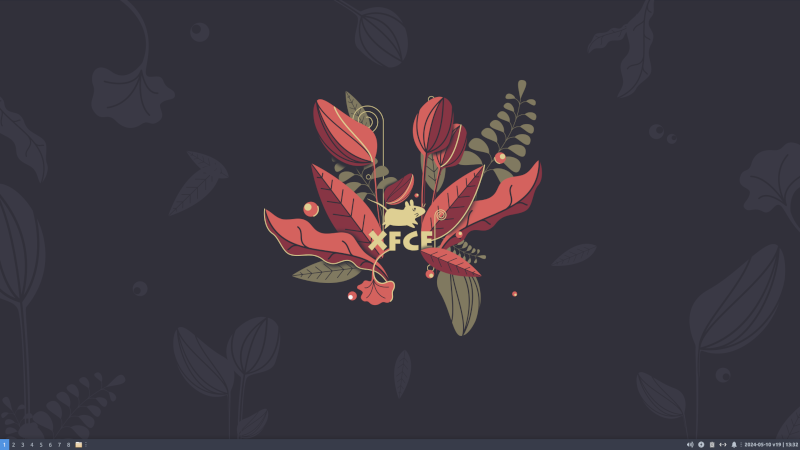
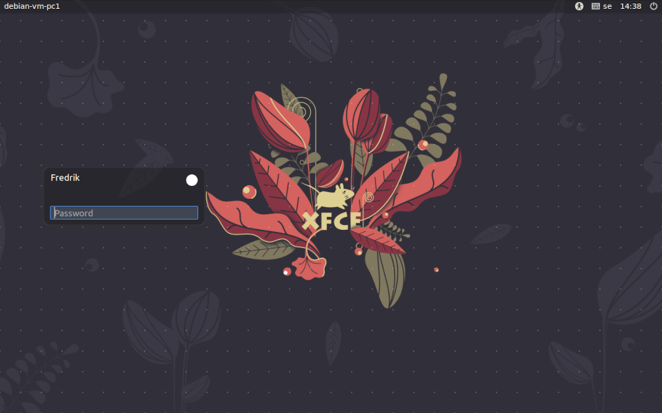

## Linux XFCE Power User

> I call this project XFCE POWER USER because of handy keybindings for applications and desktop.<br/>
> The layout for the xfce-desktop is inspired by various window managers like [i3-wm](https://i3wm.org/)<br/>



[License: MIT](https://choosealicense.com/licenses/mit)

<br/>

| My Links |                                                      |
| -------- | ---------------------------------------------------- |
| WebPage: | [fredrik.leemann.se](https://fredrik.leemann.se)     |
| GitHub:  | [github.com/freddan88](https://github.com/freddan88) |

<br/>

#### Tested on

-   Linux Mint XFCE 21.2 64Bit
-   Debian 12 XFCE 64BIT (netinst)
-   Xubuntu 22.04 64Bit

#### Download Distributions

-   [Linux Mint XFCE](https://linuxmint.com/download.php)
-   [Debian](https://www.debian.org/distrib/)
-   [Xubuntu](https://xubuntu.org/)

<br/>

#### Table of contents

-   [Installation](#installation)
-   [Keybindings for applications](#keybindings-for-applications)
-   [Keybindings for the desktop](#keybindings-for-the-desktop)
-   [Installed packages](#installed-packages)
-   [Extra packages](#extra-packages)

<br/>

### Installation

> Those scripts are intended to be run after installation and will change your configuration and packages.

<br/>

#### Install and upgrade packages

```bash
sudo apt update && sudo apt upgrade -y && sudo apt install git curl sudo wget -y
sudo apt clean -y && sudo apt autoremove -y
```

> You may want to reboot your computer after those steps to be sure you have a clean environment

<br/>

#### Download scripts

```bash
url="https://raw.githubusercontent.com/freddan88/fredrik.leemann.data/main/linux/xfce_xpu"
cd /tmp && wget $url/install_xfce_xpu_sudo.sh
cd /tmp && wget $url/install_xfce_xpu_user.sh
```

> You may configure parts in the scripts before running them. Please edit to your liking

<br/>

#### Run scripts

```bash
cd /tmp && sudo chmod 754 install_xfce_xpu*.sh
cd /tmp && sudo ./install_xfce_xpu_sudo.sh
cd /tmp && ./install_xfce_xpu_user.sh
```

> Please read the scripts before running them. They will change your configurations

`Sources:` [linux-scripts-github](https://github.com/freddan88/fredrik.leemann.data/tree/main/linux/xfce_xpu)

<br/>

#### Reboot you computer after running the scripts either from gui or from terminal

```bash
sudo reboot
```

<br/>

### Keybindings for applications

| Keybinding                                              | Application                                                                          | Description                      |
| ------------------------------------------------------- | ------------------------------------------------------------------------------------ | -------------------------------- |
| <kbd>Super</kbd> + <kbd>W</kbd>                         | Google Chrome                                                                        | My preferred Web browser         |
| <kbd>Super</kbd> + <kbd>Escape</kbd>                    | Xfce4-find-cursor                                                                    | Easily lactate the mouse-pointer |
| <kbd>Super</kbd> + <kbd>E</kbd>                         | [Thunar](https://docs.xfce.org/xfce/thunar/start)                                    | Default File Manager in XFCE     |
| <kbd>Shift</kbd> + <kbd>B</kbd>                         | [Bulk Rename](https://docs.xfce.org/xfce/thunar/bulk-renamer/start)                  | Rename multiple files            |
| <kbd>Shift</kbd> + <kbd>F</kbd>                         | [Catfish](https://docs.xfce.org/apps/catfish/start)                                  | Search for files                 |
| <kbd>Super</kbd> + <kbd>Tab</kbd>                       | [Rofi -show window](https://github.com/davatorium/rofi)                              | Show windows from all workspaces |
| <kbd>Super</kbd> + <kbd>Enter</kbd>                     | [Xfce4-terminal](https://docs.xfce.org/apps/terminal/start)                          | Open a new terminal-window       |
| <kbd>Super</kbd> + <kbd>Space</kbd>                     | [Xfce4-appfinder](https://docs.xfce.org/xfce/xfce4-appfinder/start)                  | Open the applications-menu       |
| <kbd>Super</kbd> + <kbd>T</kbd>                         | [Xfce4-terminal](https://docs.xfce.org/apps/terminal/start)                          | Open a new terminal-window       |
| <kbd>Super</kbd> + <kbd>R</kbd>                         | [Xfce4-appfinder](https://docs.xfce.org/xfce/xfce4-appfinder/start)                  | Open the applications-search     |
| <kbd>Super</kbd> + <kbd>C</kbd>                         | [Xfce4-settings-manager](https://docs.xfce.org/xfce/xfce4-settings/manager)          | Open the systems setting-manager |
| <kbd>Super</kbd> + <kbd>D</kbd>                         | [Xfce4-display-settings](https://docs.xfce.org/xfce/xfce4-settings/display)          | Open and edit display-settings   |
| <kbd>Super</kbd> + <kbd>X</kbd>                         | [Xfce4-screenshooter](https://docs.xfce.org/apps/xfce4-screenshooter/usage)          | Application to take screenshots  |
| <kbd>DISPLAY</kbd>                                      | [Xfce4-display-settings](https://docs.xfce.org/xfce/xfce4-settings/display)          | Open and edit display-settings   |
| <kbd>PRINT</kbd>                                        | [Xfce4-screenshooter](https://docs.xfce.org/apps/xfce4-screenshooter/usage)          | Application to take screenshots  |
| <kbd>MAIL</kbd>                                         | [Thunderbird](https://www.thunderbird.net/en-US/)                                    | Open preferred mail-reader       |
| <kbd>Super</kbd> + <kbd>V</kbd>                         | [Baobab](https://community.linuxmint.com/software/view/baobab)                       | Disk usage analyzer              |
| <kbd>Super</kbd> + <kbd>G</kbd>                         | [Galculator](https://community.linuxmint.com/software/view/galculator)               | Open a new calculator            |
| <kbd>Super</kbd> + <kbd>S</kbd>                         | [Pavucontrol](https://community.linuxmint.com/software/view/pavucontrol)             | Audio mixer for output and input |
| <kbd>Super</kbd> + <kbd>Z</kbd>                         | [Simplescreenrecorder](https://www.maartenbaert.be/simplescreenrecorder/)            | Record your desktop and more     |
| <kbd>Super</kbd> + <kbd>A</kbd>                         | [Stacer](https://community.linuxmint.com/software/view/stacer)                       | System optimizer and monitoring  |
| <kbd>Shift</kbd> + <kbd>Super</kbd> + <kbd>Space</kbd>  | [Bulk Rename](https://docs.xfce.org/xfce/thunar/bulk-renamer/start)                  | Rename multiple files            |
| <kbd>Ctrl</kbd> + <kbd>Super</kbd> + <kbd>Space</kbd>   | [Catfish](https://docs.xfce.org/apps/catfish/start)                                  | Search for files                 |
| <kbd>Ctrl</kbd> + <kbd>Super</kbd> + <kbd>C</kbd>       | [Xfce4-clipman-history](https://community.linuxmint.com/software/view/xfce4-clipman) | Clipboard history utility        |
| <kbd>Ctrl</kbd> + <kbd>Alt</kbd> + <kbd>Backspace</kbd> | [Xflock4](https://wiki.postmarketos.org/wiki/Screen_locker)                          | Lock the screen on your computer |
| <kbd>Ctrl</kbd> + <kbd>Alt</kbd> + <kbd>Shift-R</kbd>   | [Xfce4-session-logout --logout](https://docs.xfce.org/xfce/xfce4-session/logout)     | Logout from your session         |
| <kbd>Ctrl</kbd> + <kbd>Alt</kbd> + <kbd>Delete</kbd>    | [Xfce4-taskmanager](https://community.linuxmint.com/software/view/xfce4-taskmanager) | Process manager for XFCE         |
| <kbd>Ctrl</kbd> + <kbd>Alt</kbd> + <kbd>Escape</kbd>    | [Xkill](https://en.wikipedia.org/wiki/Xkill)                                         | Force quit applications          |
| <kbd>Ctrl</kbd> + <kbd>Alt</kbd> + <kbd>Enter</kbd>     | [Xfce4-session-logout](https://docs.xfce.org/xfce/xfce4-session/logout)              | Open a menu to handle session    |

<br/>

### Keybindings for the desktop

| Keybinding       | Description      |
| ---------------- | ---------------- |
| Work in progress | Work in progress |

<br/>

### Installed packages

> Please se the installation of apt-packages in the [script](https://github.com/freddan88/fredrik.leemann.data/blob/main/linux/xfce_xpu/install_xfce_xpu_sudo.sh)

<br/>

### Extra packages

#### Install spotify from various sources

-   [Download and install via apt](https://www.spotify.com/se/download/linux)
-   [Download and install as a flatpack](https://flathub.org/apps/com.spotify.Client)
-   [Download and install as a snap-package ](https://snapcraft.io/spotify)

<br/>

#### Install various games

```bash
sudo apt install supertux supertuxkart frozen-bubble gnome-nibbles quadrapassel openarena hedgewars
sudo apt install nexuiz freedoom teeworlds warzone2100 xmoto sauerbraten alienblaster extremetuxracer
sudo apt install alien-arena 0ad  pinball pinball-table-gnu pinball-table-hurd
```

Open Source two-dimensional platform game: [Secret Maryo Chronicles](http://www.secretmaryo.org/)

Open Source fork of the game above: [The Secret Chronicles of Dr.M](https://secretchronicles.org/en/)

<br/>

#### Speed up apt-package-manager using the nala-project

> Parallel downloads from multiple sources and new appearance

```bash
sudo apt install nala
```

> This command will scan for mirrors near you and display a list

```bash
sudo nala fetch
```

Project: [Volian Linux / nala - GitLab](https://gitlab.com/volian/nala)

<br/>

#### Install restricted codecs and packages

> Debian

```bash
sudo apt-add-repository contrib non-free
sudo apt install ttf-mscorefonts-installer unrar
```

> Ubuntu / Linux-mint

```bash
sudo add-apt-repository multiverse
sudo apt install ubuntu-restricted-extras
```

<br/>

#### Install new greeter as login-window and update settings ubuntu/debian

> I tend to like the looks of slick-greeter for lightdm rather than whats included in ubuntu/debian<br/>
> If you also wan´t to change this you can install and configure with the commands below<br/>
> lightdm and the greeter is the login-window in: ubuntu / debian / linux-mint

```bash
sudo apt install slick-greeter
cd /etc/lightdm && sudo rm -f lightdm.conf
sudo wget https://raw.githubusercontent.com/freddan88/fredrik.leemann.data/main/linux/configurations/display_managers/lightdm/lightdm.conf
```



<br/>

#### Install dictionaries for libre office

> Example for swedish dictionary

```bash
sudo apt install libreoffice-help-sv mythes-sv hunspell-sv-se hyphen-sv -y
```

-   https://packages.debian.org/source/sid/libreoffice-dictionaries
-   https://extensions.libreoffice.org/?Tags%5B%5D=50

<br/>

#### Install virtualbox guest extension if you are using a VM in virtualbox

> This will only prepare for installation you need to install from media yourself

```bash
sudo apt install linux-headers-$(uname -r) make gcc dkms build-essential -y
```

<br/>
