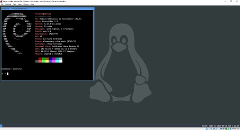
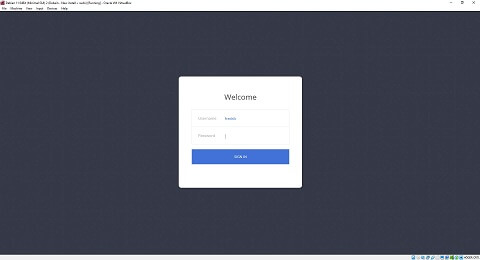

| Debian i3 Minimal - Desktop                                         | Debian i3 Minimal - Login                                       |
| ------------------------------------------------------------------- | --------------------------------------------------------------- |
|  |  |

```bash
sudo apt update && sudo apt install curl -y
```

```bash
curl -fsSL https://raw.githubusercontent.com/freddan88/fredrik.linux.files/main/i3/001_download_fonts_deb_linux.sh | sudo sh
curl -fsSL https://raw.githubusercontent.com/freddan88/fredrik.linux.files/main/i3/002_software_i3_deb_minimal.sh | sudo sh
curl -fsSL https://raw.githubusercontent.com/freddan88/fredrik.linux.files/main/i3/003_configure_i3_deb_minimal.sh | sudo sh
curl -fsSL https://raw.githubusercontent.com/freddan88/fredrik.linux.files/main/i3/004_update_i3_config_minimal.sh | sh
```

```bash
curl -fsSL https://raw.githubusercontent.com/freddan88/fredrik.linux.files/main/i3/005_software_webdev_deb_linux.sh | sudo sh
```

#### Extra (Optional)

Terminal font
Cascadia Mono SemiBold 12

Default font (system)
Ubuntu Medium 11

Disabling the graphical login

```bash
sudo update-rc.d slim disable
```

Debian autologin via terminal
https://unix.stackexchange.com/questions/401759/automatically-login-on-debian-9-2-1-command-line
