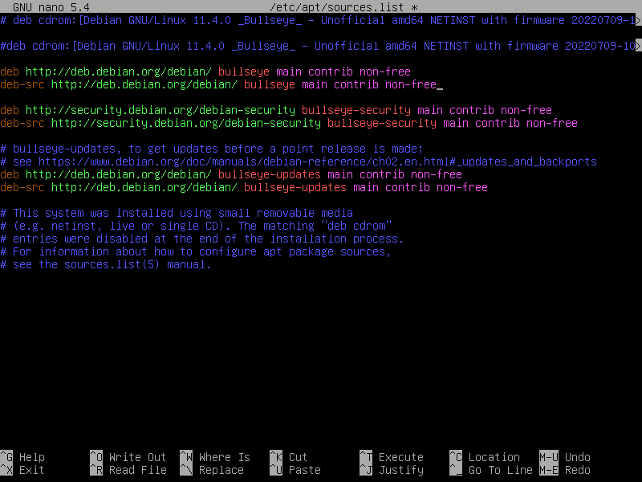
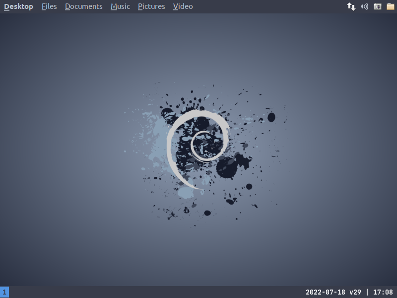

## Linux Debian i3 Minimal Installation

[License: MIT](https://choosealicense.com/licenses/mit)

| My Links  |                                                                                      |
| --------- | ------------------------------------------------------------------------------------ |
| WebPage:  | [leemann.se/fredrik](http://www.leemann.se/fredrik)                                  |
| LinkedIn: | [linkedin.com/fredrik-leemann](https://se.linkedin.com/in/fredrik-leemann-821b19110) |
| GitHub:   | [github.com/freddan88](https://github.com/freddan88)                                 |

**Tested on:**

- Debian Linux 11 (bullseye) 64Bit (nonFree Software)

---

**Download the non-free version of debian from this link**

[unofficial-non-free-netinst-cd-including-firmware-debian-linux](https://cdimage.debian.org/cdimage/unofficial/non-free/cd-including-firmware/current/amd64/iso-cd/)

**Install Debian on your computer**

- Go with a bare-bone installation with no desktop environment

- Keep the root-password blank. By doing this it will:

  - Add your user to the sudoers-group automatically

  - Disable the root-account for the new installation

  **_Screenshot from the software selection screen during installation_**

> Select SSH server and standard system utilities or only standard system utilities


**Check your sources**

> After first boot you may need to append 'main contrib non-free' in sources.list

Example

```bash
sudo nano /etc/apt/sources.list
```

> If sudo ain´t working you need to login as root and add your user to the group

```bash
apt install sudo && usermod -aG sudo <YOUR_USER_NAME> && reboot
```



### Install software

After the installation you shall login through the cli and run the below commands:

```bash
sudo apt update && sudo apt install wget curl git -y
```

**Download scripts to set-up base for minimal Debian installation**

```bash
url="https://raw.githubusercontent.com/freddan88/fredrik.leemann.data/main/linux/scripts/debain-minimal-install"
cd /tmp && wget $url/debian_root_minimal_install_all.sh
cd /tmp && wget $url/debian_user_update_config_all.sh
cd /tmp && wget $url/debian_user_update_config_i3.sh
```

Sources: [debain-minimal-install-github](https://github.com/freddan88/fredrik.leemann.data/tree/main/linux/scripts/debain-minimal-install)

**Run scripts to install minimal Debian installation**

```bash
cd /tmp && sudo chmod 754 debian*.sh
cd /tmp && sudo ./debian_root_minimal_install_all.sh
cd /tmp && ./debian_user_update_config_all.sh
cd /tmp && ./debian_user_update_config_i3.sh
```

You can run `debian_user_update_config_all.sh` and `debian_user_update_config_i3.sh` again to update configurations

**Install i3 window-manager on Debian**

```bash
sudo apt install i3 i3status -y
```

**Install Oh My Zsh**

```bash
cd /tmp && sh -c "$(curl -fsSL https://raw.github.com/ohmyzsh/ohmyzsh/master/tools/install.sh)"
```

Source: [https://ohmyz.sh](https://ohmyz.sh)

**Install Extension for Oh My Zsh**

```bash
git clone https://github.com/zsh-users/zsh-autosuggestions ${ZSH_CUSTOM:-~/.oh-my-zsh/custom}/plugins/zsh-autosuggestions
```

Source: [zsh-autosuggestions: Fish-like autosuggestions for zsh](https://github.com/zsh-users/zsh-autosuggestions)

**Download and update your zsh-config**

```bash
cd && wget -O .zshrc https://raw.githubusercontent.com/freddan88/fredrik.leemann.data/main/linux/configurations/shells/zshrc.sh
```

Source: [fredrik.leemann.data/zshrc.txt at GitHub](https://github.com/freddan88/fredrik.leemann.data/blob/main/linux/configurations/shells/zshrc.txt)

> If the x-server ain´t running you can configure it to autostart in this file by changing: autostart_x to 1

**Reboot your computer to apply new configurations and load the gui**

```bash
sudo reboot
```

### Extra (Optional)

[Tutorial: "Linux Debian web-developer utilities" install webdev software and scripts](../debian-webdev-tutorial.md)

**My favorite linux games**

```bash
sudo apt install openarena 0ad warzone2100 frozen-bubble hedgewars supertux supertuxkart quadrapassel xmoto pinball pinball-table-gnu pinball-table-hurd gnome-nibbles teeworlds -y
```

**Install virtualbox guest extension if you are using a VM through virtualbox**

> This will only prepare for installation you need to install from media yourself

```bash
sudo apt install linux-headers-$(uname -r) make gcc dkms build-essential -y
```

**Install and start spice-vdagent if you are using a VM in example KVM**

> This service needs to autostart through the i3-configuration file

```bash
sudo apt install spice-vdagent -y && sudo /etc/init.d/spice-vdagent start
```

**Speed up apt-package-manager using the nala-project**

Project: [Volian Linux / nala · GitLab](https://gitlab.com/volian/nala)

---

### Example desktop configurations

| Theme   |                      |
| ------- | -------------------- |
| Icons:  | elementary Xfce dark |
| System: | Arc-Dark             |

| Fonts     |                           |
| --------- | ------------------------- |
| Terminal: | Cascadia Mono SemiBold 12 |
| System:   | Ubuntu Medium 11          |

| Debian i3 Minimal - Desktop 01                       | Debian i3 Minimal - Desktop 02                       |
| ---------------------------------------------------- | ---------------------------------------------------- |
|  |  |

### Important keybindings

_i3keybindings.sh will automatically run on every login and restart_

| Keybinding                                      | Program / Scriipt    | Description                    |
| ----------------------------------------------- | -------------------- | ------------------------------ |
| <kbd>super</kbd> + <kbd>enter</kbd>             | Xfce4 terminal       | Open a new terminal-window     |
| <kbd>super</kbd> + <kbd>space</kbd>             | xfce4-appfinder      | Search for applications        |
| <kbd>super</kbd> + <kbd>q</kbd>                 | kill                 | Close focused window           |
| <kbd>ctrl</kbd> + <kbd>alt</kbd> + <kbd>g</kbd> | i3keybindings.sh     | Generate a list of keybindings |
| <kbd>ctrl</kbd> + <kbd>alt</kbd> + <kbd>k</kbd> | google-chrome + keys | Read all i3 keybindings        |
| <kbd>ctrl</kbd> + <kbd>alt</kbd> + <kbd>l</kbd> | slimlock             | Logout from the system         |
| <kbd>ctrl</kbd> + <kbd>alt</kbd> + <kbd>p</kbd> | poweroff             | Shutdown the system            |
| <kbd>ctrl</kbd> + <kbd>alt</kbd> + <kbd>r</kbd> | reboot               | Reboot the system              |

### Some of the programs

_Please read the source of the scripts above to get a full list of programs_

- [google-chrome-stable](https://dl.google.com/linux/direct/google-chrome-stable_current_amd64.deb)
- [xfce4-panel-profiles](http://ftp.ports.debian.org/debian-ports/pool/main/x/xfce4-panel-profiles)
- [pulseaudio-ctl](https://github.com/graysky2/pulseaudio-ctl)

### Links and resources

- [unix.stackexchange.com - automatically-login-on-debian-9-2-1-command-line](https://unix.stackexchange.com/questions/401759/automatically-login-on-debian-9-2-1-command-line)
- [github.com/denesb - Workspaces plugin for xfce4 and the i3 window manager.](https://github.com/denesb/xfce4-i3-workspaces-plugin)
- [SDLPoP · Prince of Persia: Original Trilogy](https://www.popot.org/get_the_games.php?game=SDLPoP)
- [Configuring i3 Window Manager: a Complete Guide](https://thevaluable.dev/i3-config-mouseless)
- [i3 improved tiling wm - user’s Guide](https://i3wm.org/docs/userguide.html)
- [NetworkManager - Debian Wiki](https://wiki.debian.org/NetworkManager)
- [http://www.secretmaryo.org](http://www.secretmaryo.org)

```

```
