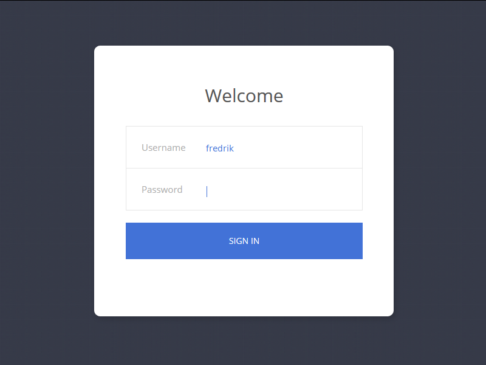

## My Debian i3 Minimal Installation

[License: MIT](https://choosealicense.com/licenses/mit)

| My Links  |                                                                                      |
| --------- | ------------------------------------------------------------------------------------ |
| WebPage:  | [leemann.se/fredrik](http://www.leemann.se/fredrik)                                  |
| LinkedIn: | [linkedin.com/fredrik-leemann](https://se.linkedin.com/in/fredrik-leemann-821b19110) |
| GitHub:   | [github.com/freddan88](https://github.com/freddan88)                                 |

**Tested on:**

- Debian Linux 11 (bullseye) 64Bit (nonFree Software)

---

**Download the non edu-version of debian from this link**

[unofficial-non-free-netinst-cd-including-firmware-debian-linux](https://cdimage.debian.org/cdimage/unofficial/non-free/cd-including-firmware/current/amd64/iso-cd/)

**Install Debian on your computer**

- Go with a bare-bone installation with no desktop environment

- Keep the root-password blank. By doing this it will:

  - Add your user to the sudoers-group automatically

  - Disable the root-account for the new installation

  **_Screenshot from the software selection screen during installation_**

> Select SSH server and standard system utilities or only standard system utilities


**Check your sources**

> After first boot you may need to append 'main contrib non-free' in sources.list


### Install software

After the installation you shall login through the cli and run the below commands:

```bash
sudo apt update && sudo apt install curl sudo wget -y
```

> If sudo ain´t working you need to login as root and add your user to the group

```bash
usermod -aG sudo <YOUR_USER_NAME> && reboot
```

**Install fonts**

```bash
curl -fsSL https://raw.githubusercontent.com/freddan88/fredrik.leemann.data/main/linux/scripts/i3-debian-minimal-install/001_install_fonts_deb.sh | sudo sh
```

Source: [001_install_fonts_deb.sh](https://github.com/freddan88/fredrik.leemann.data/blob/main/linux/scripts/i3-debian-minimal-install/001_install_fonts_deb.sh)

**Install i3 software**

```bash
curl -fsSL https://raw.githubusercontent.com/freddan88/fredrik.leemann.data/main/linux/scripts/i3-debian-minimal-install/002_software_i3_deb_min.sh | sudo sh
```

Source: [002_software_i3_deb_min.sh](https://github.com/freddan88/fredrik.leemann.data/blob/main/linux/scripts/i3-debian-minimal-install/002_software_i3_deb_min.sh)

**Configure system**

```bash
curl -fsSL https://raw.githubusercontent.com/freddan88/fredrik.leemann.data/main/linux/scripts/i3-debian-minimal-install/003_configure_system_deb.sh | sudo sh
```

Source: [003_configure_system_deb.sh](https://github.com/freddan88/fredrik.leemann.data/blob/main/linux/scripts/i3-debian-minimal-install/003_configure_system_deb.sh)

**Update i3 config**

```bash
curl -fsSL https://raw.githubusercontent.com/freddan88/fredrik.leemann.data/main/linux/scripts/i3-debian-minimal-install/004_update_i3_config_min.sh | sh
```

Source: [004_update_i3_config_min.sh](https://github.com/freddan88/fredrik.leemann.data/blob/main/linux/scripts/i3-debian-minimal-install/004_update_i3_config_min.sh)

**Install Oh My Zsh**

```bash
sh -c "$(curl -fsSL https://raw.github.com/ohmyzsh/ohmyzsh/master/tools/install.sh)"
```

Source: [https://ohmyz.sh](https://ohmyz.sh)

**Install Extension for Oh My Zsh**

```bash
git clone https://github.com/zsh-users/zsh-autosuggestions ${ZSH_CUSTOM:-~/.oh-my-zsh/custom}/plugins/zsh-autosuggestions
```

Source: [zsh-autosuggestions: Fish-like autosuggestions for zsh](https://github.com/zsh-users/zsh-autosuggestions)

**Download and update your zsh-config**

```bash
cd && wget -O .zshrc https://raw.githubusercontent.com/freddan88/fredrik.leemann.data/main/linux/configurations/shells/zshrc.txt
```

Source: [fredrik.leemann.data/zshrc.txt at GitHub](https://github.com/freddan88/fredrik.leemann.data/blob/main/linux/configurations/shells/zshrc.txt)

> Tip: You can configure autostart of x in this file by changing: autostart_x to 1

### Extra (Optional)

**Install web-developer software**

```bash
curl -fsSL https://raw.githubusercontent.com/freddan88/fredrik.leemann.data/main/linux/scripts/i3-debian-minimal-install/005_software_webdev_deb.sh | sudo sh
```

Source: [005_software_webdev_deb.sh](https://github.com/freddan88/fredrik.leemann.data/blob/main/linux/scripts/i3-debian-minimal-install/005_software_webdev_deb.sh)

**Download web-developer scripts**

```bash
curl -fsSL https://raw.githubusercontent.com/freddan88/fredrik.leemann.data/main/linux/scripts/i3-debian-minimal-install/006_download_webdev_scripts.sh | sudo sh
```

Source: [006_download_webdev_scripts.sh](https://github.com/freddan88/fredrik.leemann.data/blob/main/linux/scripts/i3-debian-minimal-install/006_download_webdev_scripts.sh)

**Install NVM (Node Version Manager)**

```bash
cd /tmp && wget -qO- https://raw.githubusercontent.com/nvm-sh/nvm/v0.39.1/install.sh | bash
```

Source: [GitHub - nvm-sh/nvm: Node Version Manager](https://github.com/nvm-sh/nvm)

> Reboot your computer with the command `sudo reboot` and run below after

```bash
nvm install --lts && nvm alias default node && nvm use node
```

**Disabling the graphical login**

```bash
sudo update-rc.d slim disable
```

**Configure Debian to log in automatically through cli**

[unix.stackexchange.com - automatically-login-on-debian-9-2-1-command-line](https://unix.stackexchange.com/questions/401759/automatically-login-on-debian-9-2-1-command-line)

**My favorite linux games**

```bash
sudo apt install openarena 0ad warzone2100 frozen-bubble hedgewars supertux supertuxkart quadrapassel xmoto pinball pinball-table-gnu pinball-table-hurd gnome-nibbles teeworlds -y
```

**Install virtualbox guest extension if you are using a VM in virtualbox**

> This will only prepare for installation you need to install from media yourself

```bash
sudo apt install linux-headers-$(uname -r) make gcc dkms build-essential -y
```

**Install and start spice-vdagent if you are using a VM in example KVM**

> This service needs to autostart through the i3-configuration file

```bash
sudo apt install spice-vdagent -y && sudo /etc/init.d/spice-vdagent start
```

---

### Example desktop configurations

| Fonts     |                           |
| --------- | ------------------------- |
| Terminal: | Cascadia Mono SemiBold 12 |
| System:   | Ubuntu Medium 11          |

| Debian i3 Minimal - Desktop 01                       | Debian i3 Minimal - Desktop 02                       |
| ---------------------------------------------------- | ---------------------------------------------------- |
|  |  |

| Debian i3 Minimal - Login-screen 01               | Debian i3 Minimal - Login-screen 02         |
| ------------------------------------------------- | ------------------------------------------- |
|  |  |

### Links and resources

- [reddit.com - What happened to libappindicator3-1 in Debian 11](https://www.reddit.com/r/debian/comments/pn1oia/what_happened_to_libappindicator31_in_debian_11)
- [wuwablog.blogspot.com - atftpd vs tftpd-hpa](http://wuwablog.blogspot.com/2018/07/atftpd-vs-tftpd-hpa.html)
- [github.com/denesb - Workspaces plugin for xfce4 and the i3 window manager.](https://github.com/denesb/xfce4-i3-workspaces-plugin)
- [SDLPoP · Prince of Persia: Original Trilogy](https://www.popot.org/get_the_games.php?game=SDLPoP)
- [How to Change the Default Terminal in Ubuntu - FOSS](https://itsfoss.com/change-default-terminal-ubuntu)
- [Configuring i3 Window Manager: a Complete Guide](https://thevaluable.dev/i3-config-mouseless)
- [NetworkManager - Debian Wiki](https://wiki.debian.org/NetworkManager)
- [http://www.secretmaryo.org](http://www.secretmaryo.org)
