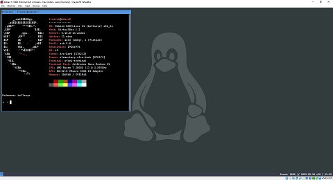
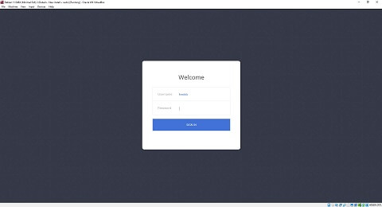

| Debian i3 Minimal - Desktop                        | Debian i3 Minimal - Login                      |
| -------------------------------------------------- | ---------------------------------------------- |
|  |  |

**1 Download Debian**

https://cdimage.debian.org/cdimage/unofficial/non-free/cd-including-firmware/current/amd64/iso-cd

```bash
sudo apt update && sudo apt install curl -y
```

**Install fonts**

```bash
curl -fsSL https://raw.githubusercontent.com/freddan88/fredrik.linux.files/main/i3/001_download_fonts_deb.sh | sudo sh
```

**Install i3 software**

```bash
curl -fsSL https://raw.githubusercontent.com/freddan88/fredrik.linux.files/main/i3/002_software_i3_deb_min.sh | sudo sh
```

**Configure system**

```bash
curl -fsSL https://raw.githubusercontent.com/freddan88/fredrik.linux.files/main/i3/003_configure_system_deb.sh | sudo sh
```

**Update i3 config**

```bash
curl -fsSL https://raw.githubusercontent.com/freddan88/fredrik.linux.files/main/i3/004_update_i3_config_min.sh | sh
```

#### Extra (Optional)

| Fonts    |                           |
| -------- | ------------------------- |
| Terminal | Cascadia Mono SemiBold 12 |
| System   | Ubuntu Medium 11          |

**Install web-developer software**

```bash
curl -fsSL https://raw.githubusercontent.com/freddan88/fredrik.linux.files/main/i3/005_software_webdev_deb.sh | sudo sh
```

**Download web-developer scripts**

```bash
curl -fsSL https://raw.githubusercontent.com/freddan88/fredrik.linux.files/main/i3/006_download_webdev_scripts.sh | sudo sh
```

**Disabling the graphical login**

```bash
sudo update-rc.d slim disable
```

**Configure Debian to log in automatically through cli**

https://unix.stackexchange.com/questions/401759/automatically-login-on-debian-9-2-1-command-line
